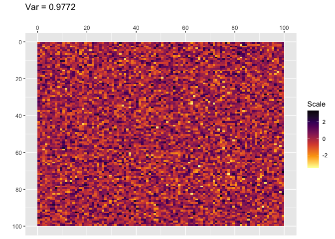

<!-- README.md is generated from README.Rmd. Please edit that file -->

# randomfields

<!-- badges: start -->

[](https://github.com/C-Juliette/randomfields/actions/workflows/R-CMD-check.yaml)
[](https://codecov.io/gh/C-Juliette/randomfields?branch=main)
[](https://github.com/C-Juliette/randomfields/actions/workflows/test-coverage.yaml)
<!-- badges: end -->

Shiny App associée :
<https://juliette-chiapello.shinyapps.io/RandomFields/>

– *English version below* –

Le principe est de générer des champs aléatoires en 2D, puis de calculer
leurs corrélations.  
Un champ en 2D est un ensemble de valeurs sur une grille (x ,y). Ces
valeurs sont, dans notre cas, des réalisations de variables
aléatoires.  
Le but de ce package est de donner des outils pour calculer la
corrélation entre deux variables aléatoires : une située en un point
(x<sub>1</sub>, y<sub>1</sub>) et une autre située en un point
(x<sub>2</sub>, y<sub>2</sub>).  
On peut montrer qu’en appliquant des moyennes glissantes à des champs
générés par des variables aléatoires indépendantes, on obtient des
champs structurés et des variables aléatoires dépendantes.

– *English version* –

This package considers randomly generated matrix as maps. It plots the
maps and indicates the variance and the distribution of a realization.
It does moving average to generate new maps which are spatially
structured. It calculates the covariance between points on spatial
structured maps. And it subsamples maps, with or without an average of
the neighbored points.

More precisely :

The principle is to generate random fields in 2D and then calculate
their correlations.  
A 2D field is a set of values on a grid (x, y). In our case, these
values are realizations of random variables.  
The purpose of this package is to provide tools for calculating the
correlation between two random variables: one located at a point
(x<sub>1</sub>, y<sub>1</sub>) and another located at a point
(x<sub>2</sub>, y<sub>2</sub>).  
It can be shown that by applying moving averages to fields generated by
independent random variables, structured fields and dependent random
variables are obtained.

## Getting started

You can install the package randomfields from github :

``` r
remotes::install_github("https://github.com/C-Juliette/randomfields")
```

## Génération d’un champ aléatoire qui suit une loi normale

On souhaite générer un champ aléatoire de taille 100x100. Chacun des
10000 points correspond à une réalisation d’une variables aléatoire.
Toutes les variables aléatoires sont indépendantes et identiquement
distribuées (iid) suivant une loi normale centrée réduite.

``` r
library(randomfields)
my_random_field <- gen_norm(100)
```

On peut visualiser ce champ (cette loi normale en 2D) :

``` r
plot_matrix(my_random_field)
```



## Corrélation entre les points

Les variables sont-elles corrélées ?

Le vecteur indique la direction dans laquelle on se place pour étudier
la corrélation. C’est un vecteur directeur (ici il s’agit de la
corrélation des points selon la direction (0, 1)).

``` r
actual_correlation(my_random_field, c(0,1)) |> 
  head(10)
#>    Distance_pixels Distance_km Empirical_covariance Empirical_correlation
#> 1                0           0         0.9771622050          1.0000000000
#> 2                1           1        -0.0003432377         -0.0003509797
#> 3                2           2        -0.0018308075         -0.0018724473
#> 4                3           3        -0.0008582630         -0.0008771434
#> 5                4           4        -0.0138465606         -0.0141468923
#> 6                5           5         0.0082628227          0.0084230526
#> 7                6           6        -0.0012158138         -0.0012376256
#> 8                7           7        -0.0020800520         -0.0021144567
#> 9                8           8        -0.0011162387         -0.0011322669
#> 10               9           9        -0.0142358961         -0.0144551643
```

La corrélation est nulle (aux fluctuations statistiques près). La
corrélation ne vaut 1 que lorsqu’on qu’on considère la corrélation de la
variable avec elle-même (distance nulle).

## Application d’un moyenne glissante

On applique une fenêtre glissante carrée de côté r = 6 sur le champ
aléatoire.

``` r
structured_field <- moving_average(my_random_field, r=6)
```

On peut visualiser ce champ :

``` r
plot_matrix(structured_field)
```


Des structures sont apparues. La variance a diminué (les valeurs sont
plus proches les unes des autres, la moyenne glissante “gomme” les
écarts).

Cela se retranscrit au niveau des corrélations :

``` r
actual_correlation(structured_field, c(0, 1)) |> 
  head(10)
#>    Distance_pixels Distance_km Empirical_covariance Empirical_correlation
#> 1                0           0          0.005863657             1.0000000
#> 2                1           1          0.005441513             0.9261279
#> 3                2           2          0.005031841             0.8540028
#> 4                3           3          0.004584651             0.7763849
#> 5                4           4          0.004097430             0.6925498
#> 6                5           5          0.003649708             0.6150813
#> 7                6           6          0.003142876             0.5285943
#> 8                7           7          0.002607207             0.4371363
#> 9                8           8          0.002112413             0.3535144
#> 10               9           9          0.001621311             0.2700478
```

Les variables aléatoires sont corrélées et leur corrélations diminue
avec la distance qui les sépare.

## Visualisation des graphiques de corrélation

``` r
plot_actual_cov(my_random_field, c(6), list(c(0, 1)), max = 20)
#> Warning in geom_line(aes(group = interaction(Radius, Direction), col = Radius,
#> : Ignoring unknown aesthetics: shape
#> Warning: Removed 67 rows containing missing values (`geom_point()`).
#> Warning: Removed 67 rows containing missing values (`geom_line()`).
```


``` r
plot_actual_cov(my_random_field, c(6), list(c(0, 1)), max = 20)
#> Warning in geom_line(aes(group = interaction(Radius, Direction), col = Radius,
#> : Ignoring unknown aesthetics: shape
#> Warning: Removed 67 rows containing missing values (`geom_point()`).
#> Warning: Removed 67 rows containing missing values (`geom_line()`).
```


